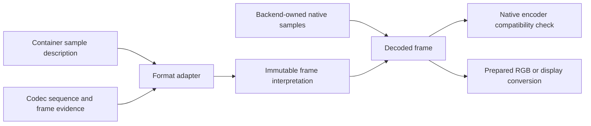

# Frame interpretation: implementation reference

Proposal, 2026-09-29. **This PR contains design and acceptance criteria, not
implemented APIs or passing media integration tests.** Rust snippets below are
API sketches except those explicitly labeled current code. Names are provisional.
Start with the [API overview](frame-interpretation-contract.md). It defines the
two access levels and early-validation policy; this reference supplies the
implementation details. The implementation must prove these contracts before
promoting new public types.

This supplements the [release contract](finalization-release-contract.md) and
[sample encoding contract](sample-encoding-contract.md). It replaces the proposed
`Cicp::resolve_matrix(hint)` approach in [#55](https://github.com/imazen/zenpixels/pull/55).
It does not mark #55, [#74](https://github.com/imazen/zenpixels/pull/74), or their
remaining acceptance criteria complete.

## Decision

Preserve declarations we cannot execute. Run cheap declaration and format checks
as soon as their inputs are available, then validate each requested operation
against the additional information it needs. Format adapters select interpretation according
to their format rules; conversion backends determine executable support.

There is no global `ValidCicp` type and no matrix hint on `Cicp`. This does not
preclude early validation: constructors with sufficient layout/context reject
known-invalid combinations, and the reader checks available headers at build.
A recognized code alone does not prove decoder capability or display policy.
Constructing raw `Cicp` remains infallible and retains its numeric fields.

Ordinary callers ask for native frames or a named output representation. They
do not manually reconcile the container and bitstream or learn every CICP code.
Advanced callers can inspect evidence and make explicit, recorded repairs.



## 1. What stays representable

| Situation | Carrier | When it becomes an error |
|---|---|---|
| Unknown/reserved CICP code | Raw `Cicp` and source evidence | An operation needs its meaning and cannot implement it |
| Absent field versus explicit code 2 | Media evidence preserves presence | An operation needs a value with no permitted inference |
| Unknown range | Media evidence, not a fabricated `Cicp::full_range` bool | Range-dependent reconstruction/encoding needs a resolved range |
| Container/bitstream conflict | Both claims plus a diagnostic | Normal reader fails as soon as both applicable claims are available; inspection retains them |
| Supported matrix with unknown transfer | Native frame, possibly encoded RGB | Display/color conversion needs that transfer |
| Malformed metadata | Bounded raw payload plus parse diagnostic, if recoverable | Typed parsing or safe sample decoding requires the malformed data |
| Unsupported HDR payload | Bounded scoped evidence | A requested rendering/preservation guarantee depends on interpreting it |
| Ten-bit codes in U16 | Native plane + `SampleEncoding` | Never silently become normalized RGB16 |

Native inspection is not permission to ignore malformed codec headers needed for
safe decoding. Recovery of metadata is separate from decoder conformance.
Packet copy still requires a valid destination mapping and preservation of
necessary configuration; unknown color is not permission to drop boxes.

Keep source payloads at their native field width; narrowing into `Cicp` must be
checked. Do not wrap an unrepresentable source value with `as u8`. Code zero,
explicit unspecified, missing, and unsupported are distinct facts.

## 2. Internal frame model, existing core vocabulary

The following is an implementation decomposition, not the public docs.rs tree.
Keep `FrameEvidence`, `FrameInterpretation`, and `ColorInterpretation` private
unless a real expert caller requires a borrowed view. The ordinary public
workflow is in the [overview](frame-interpretation-contract.md). This sketch
shows crate-private access; adapters control construction:

```rust,ignore
impl DecodedFrame {
    pub(crate) fn timing(&self) -> &FrameTiming;
    pub(crate) fn interpretation(&self) -> &FrameInterpretation;
    pub(crate) fn evidence(&self) -> &FrameEvidence;
    pub(crate) fn map(&self) -> Result<MappedFrame<'_>, MediaError>;
}

impl MappedFrame<'_> {
    pub(crate) fn native_view(&self) -> NativeFrameView<'_>;
}

impl FrameInterpretation {
    // Selected declarations, not proof that a converter implements them.
    // Individual fields may remain missing or conflicted.
    pub(crate) fn color(&self) -> &ColorInterpretation;
}
```

`FrameEvidence` references bounded immutable sample-description/sequence evidence
and applicable frame metadata. It retains field presence, selected source,
conflicts, and explicit caller repairs. Accessors return borrowed information;
formatting strings or building a full audit report happens only when requested.
Avoid a public generic provenance framework until these two adapters prove it.

`FrameInterpretation` includes component roles, sample encoding, geometry,
subsampling/siting, range, selected color authority, and applicable HDR meaning.
Storage description remains available when color cannot be interpreted.
ICC describes the reconstructed color interpretation; it does not supply the
YCbCr matrix, range, or chroma location. Selection must preserve that distinction.

Current primitives stay in their existing modules: `sample::SampleEncoding`,
`Cicp`, `ColorContext`, and small `hdr` carriers. Do not move timestamps, source
claims, packet data, decoder handles, or metadata-engine types into zenpixels.

## 3. Code that should stop looking safe

### Matrix fallback is not format interpretation

```rust,ignore
// Proposed by #55; should NOT become the public API.
let source = Cicp::new(9, 16, 200, false);
let selected = source.resolve_matrix(Some(9))?;
// A declared unknown transform has been replaced with a different transform.
```

Instead the adapter applies a pinned format policy to all available claims.
Default policy is format-defined inference only. Missing/unspecified can be
filled where that format permits it; an unsupported specified transform is not
replaced merely because another one is easier to execute. Repairing malformed
input requires a separately named policy and preserves the original evidence.

AV1-in-MP4 rules, pinned to
[AV1 ISOBMFF v1.3.0, section 2.3.4](https://aomediacodec.github.io/av1-isobmff/v1.3.0.html#semantics):
container primaries, transfer and matrix can fill corresponding absent or
unspecified bitstream fields; otherwise specified values must agree. The range
flags must agree. Resolve each field with provenance, then validate the resulting
combination for the requested operation. A mismatch is a conformance diagnostic,
not a backend-selection opportunity. Do not reuse this policy for every codec.

### A descriptor projection does not reconstruct samples

```rust,ignore
// CURRENT CODE: compiles and drops the matrix declaration.
let yuv = Cicp::new(9, 16, 9, false);
let descriptor = yuv.to_descriptor(PixelFormat::Rgb16);
```

```rust,ignore
// PROPOSED expert path: the session has already attached applicable evidence.
if let Some(frame) = session.next_frame()? {
    let mapping = frame.map()?;
    let source = mapping.native_view();
    let plan = rgb_converter.prepare(source.interpretation(), output_request)?;
    plan.write_rows(source, &mut destination)?;
    // Output descriptor/context come from the plan's resulting interpretation.
}
```

`prepare` is operation-specific: encoded RGB reconstruction can accept an unknown
transfer when its matrix math does not require that transfer; display conversion
cannot. A native encoder can accept the original samples without an RGB pass
only after checking layout, sample meaning, and destination signaling support.

Deprecate ambiguous `Cicp::to_descriptor` in the 0.2 bridge after migrating its
consumers. Add the same checked already-RGB declaration path in both releases,
then remove the ambiguous helper in 0.3. Exact public spelling is deferred until
the media and converter callers share one implementation. Its contract must:

- Require RGB/gray component interpretation appropriate to the requested format;
  identity matrix alone does not establish RGB component meaning or layout.
- Preserve raw unsupported primaries/transfer in context instead of treating
  `Unknown` descriptor enums as a complete color description.
- Preserve declared range; descriptor construction does not expand it.
- Promise structural declaration checks only, never verification of pixel values.

### A queued frame must not inherit a newer frame's color

```rust,ignore
// WRONG: the decoder/session has advanced since this frame was queued.
let plan = prepare_rgb(track.current_color(), request)?;
plan.convert(&old_frame)?;

// PROPOSED: input and prepared meaning must match, including frame metadata
// actually used by the requested operation.
let mapping = old_frame.map()?;
let view = mapping.native_view();
let plan = converter.prepare(view.interpretation(), request)?;
plan.write_rows(view, &mut destination)?;
```

The converter may reuse an existing plan when its semantic input requirements
match. An epoch alone, pointer equality alone, or a hash alone is not a proof of
compatibility. Pixel address/stride validation still occurs for each supplied
view. Frame-specific HDR parameters used by rendering participate in preparation
or explicit parameter updates even if the codec configuration is unchanged.

## 4. Ownership, timing, and scope

Keep backend pictures alive through a private storage abstraction supporting
backend ownership and owned planes. Do not standardize `Vec`-only frame fields
or expose rav1d/AOM types in the shared API. A mapped view borrows the mapping
guard, which borrows the frame. Holding an old frame while decoding a new one
must not copy pixels or invalidate the old mapping.

Mapping may fail or synchronize a backend; it is not universally free. Software
borrowed planes should map without a pixel allocation. Conversion to owned
packed RGB explicitly allocates output; a row sink uses bounded scratch instead.
No `Copy` promise for a mapping guard and no generic public provider trait yet.

The frame is a presentation occurrence, not merely a picture allocation. A
repeated picture can share storage but have a different timestamp and applicable
presentation metadata. Format-specific rules determine metadata persistence;
do not carry every HDR payload forward forever or reset it on every packet.

Associate configuration/evidence with output through decoder reordering. Packet
ordinal is not a frame number, and the newest input packet does not necessarily
describe the next returned frame. Seek flushes pending association state and
restores applicable configuration; already returned frames retain their snapshot.

Maintain separate concepts for codec configuration, container sample-description
selection, and interpretation changes. A `colr`-only change must not require
different codec-private bytes to become visible. Do not reset/drop delayed
decoded frames automatically on every metadata change.

The shared packet/timing layer remains usable for audio. Audio blocks do not
depend on pixel interpretation or color features.

## 5. Errors and cost model

Use structured, non-exhaustive errors in the media/conversion modules rather
than one `UnspecifiedMatrixError` in core. Preserve underlying backend errors.

| Error category | Example | Boundary |
|---|---|---|
| Missing interpretation | No permitted matrix inference | Preparing an operation that needs a matrix |
| Conflicting declarations | Specified container and bitstream matrices differ | Reader build or header update, as soon as both applicable claims are available |
| Invalid combination | Identity components with forbidden subsampling for this format | Checked format/layout construction; do not defer to conversion |
| Unsupported implementation | Recognized matrix 15, backend lacks transform | Reader build if target and source are known; otherwise first relevant header update or expert preparation |
| Missing rendering policy | HLG display request without required policy | Display preparation |
| Input does not match plan | Range/depth changed since preparation | Before writing that frame |
| Invalid sample/value | Requested clipping refusal encounters an excursion | During processing, unless caller requests explicit preflight |

Diagnostics retain field/code/source and track/configuration/timestamp context
when available. A raw decoder outside a container need not fabricate a track ID.
Explicit inspection access may expose conflicted frames for native inspection; it must not turn
that conflict into a silently selected interpretation for RGB rendering.

The high-level reader checks known metadata at build and at relevant updates.
Operation preparation reuses those checks and adds backend/target requirements;
it is not the first opportunity to reject an already-known contradiction.
Metadata-detectable failures occur before destination writes. Sample-dependent
failures and backend errors may occur after partial writes to caller output;
document that explicitly. Guaranteed unchanged-on-error requires an explicit
preflight where possible or temporary output, not an invisible full-frame pass.

| Work | Cost expectation |
|---|---|
| Construct sample view | O(planes), no sample scan |
| Select interpretation | Bounded metadata work when claims change |
| Share unchanged evidence across frames | Shared ownership, no ICC/pixel copy |
| Check prepared input | Small descriptor/parameter comparisons per frame |
| Map software backend picture | Borrow guards, no pixel copy |
| Reconstruct/render | Explicit pass; compatible stages may fuse |
| Pixel conformance/peak/opacity audit | Explicit scan or documented fused work |

No new zenpixels feature, dependency, or media re-export. Keep operation code in
media/conversion, with dependencies pointing toward core. Container-only reading
must not pull in AV1 decoding or CMS. Native AV1 decoding must not require a
display backend. Reuse existing feature boundaries rather than one flag per
metadata field. Conversion engines use existing runtime services where suitable.

## 6. Inventory and implementation sequence

Inspected immutable snapshots (not a claim about all open PRs or later revisions):

| Snapshot | Finding / required edit |
|---|---|
| zenpixels bridge `591a4eb`, `zenpixels/src/cicp.rs` | Raw preservation exists; `to_descriptor` erases matrix. Migrate converter `output.rs` and media `frame.rs` before deprecation. |
| zenavif `a7c56be`, `src/cicp_resolve.rs` | Values 15+ enter the reserved/hint arm. Add explicit refusal for recognized unsupported transforms, preserving raw evidence; audit format precedence separately. |
| [zencodec media `e914874`](https://github.com/imazen/zencodec/tree/e914874a566915b39884c8da78af24558861941f/media), `av1.rs` | Backend ownership/mapping and raw CICP exist. Preserve absent-versus-inferred evidence if the backend exposes it; extend backend extraction if needed, never infer presence from a flattened value. |
| Same snapshot, `color.rs`, `frame.rs` | Native view and separate reconstruction/display exist. Integrate operation-specific diagnostics and frame interpretation; reuse these converters. |
| Same snapshot, `session.rs` | `VideoFrame` requires owned Vec planes and one CICP. Replace mandatory copies with opaque storage/mapping; carry immutable interpretation/evidence. |
| Same snapshot, `track.rs`, `mp4.rs` | Configuration epochs exist, but no color claims. `parse_sample_entry` handles H.264/audio, not `av01`; unknown entries become `Other("unmapped")`. AV1-in-MP4 is not implemented by adding `colr` alone. |

Stack implementation on the existing
[zencodec #129](https://github.com/imazen/zencodec/pull/129) media work. Coordinate
[#130](https://github.com/imazen/zencodec/pull/130) metadata integration against the
same frame evidence contract; do not create a second resolver or metadata store.

1. **Interpretation and diagnostics:** private field-aware selection, source
   retention, early declaration/format checks, target-specific checks, zenavif regression. Keep the public core
   resolver out of #55. Update registry names separately where appropriate.
2. **Frame ownership and scope:** backend-owned/owned-plane storage, mappings,
   immutable evidence, reorder/seek/repeated-picture tests, plan compatibility.
3. **AV1-in-MP4 integration:** `av01`/`av1C`, bounded color-box parsing, sample
   description changes, decoder packet/configuration plumbing, end-to-end corpus.
   Fragmented MP4 remains explicitly unsupported until its own implementation.
4. **Core migration:** prove the checked RGB declaration with real callers, add
   it in #76, propagate to #77, deprecate/remove the old projection on the proper
   lines. Re-run source-compatibility probes. Do not deprecate before providing
   a usable common migration destination.

These are review slices, not promises to publish four new crates. The design PR
is based on #76 so its migration contract is visible before either release;
#77 inherits it when updated to the bridge. No release is published by this work.

## 7. Required acceptance evidence

All entries below are **pending implementation**, not tests passed by this PR.

| Fixture / operation | Expected result |
|---|---|
| MP4 matrix 9, AV1 matrix absent/2 | Select 9 with container provenance |
| MP4 matrix 1, AV1 specified matrix 9 | Normal reader fails at build/header update; inspection retains both claims |
| Container/bitstream range disagree | Early conflict failure in normal reader; do not reinterpret sample values |
| Specified matrix 15/16/17 plus familiar fallback | Preserve code; unsupported backend refuses without substitution |
| Reserved/unrecognized matrix plus familiar fallback | Native inspection retains it; default conversion refuses |
| Raw container field exceeds core code width | Retain raw value; checked narrowing fails, no truncation |
| Fixed supported NCL matrix, unknown transfer | Encoded RGB reconstruction allowed; display conversion refused |
| Missing chroma location on subsampled input | Preserve unknown; reconstruction requiring siting refuses |
| Identity/forbidden subsampling combination | Reject at checked format/layout construction; never treat planes as ordinary YCbCr |
| Native 10/12-bit full/narrow frames | Preserve words/pointers; explicit RGB16 output uses normalized domain |
| Chroma neutral, narrow anchors, excursions, alpha | Correct component-specific arithmetic; explicit clipping/pass policy |
| Old frame held across sequence/sample-description change | Old samples and interpretation remain unchanged |
| Color-only sample-description change | Visible without changing codec-private bytes |
| Reordered output / repeated picture / seek | Correct presentation occurrence, source association and metadata scope |
| Dynamic HDR changes with stable codec epoch | Relevant rendering parameters update; no stale plan reuse |
| Crop with odd origin, padded strides | Preserve chroma phase and validate actual extents |
| Backend frame outlives decoder; mapped guard lifetimes | Runtime retention and compile-fail borrow tests, no frame copy |
| Prepared output receives incompatible frame | Error before first destination write |
| Backend or sample-value failure partway through rows | Documented partial-write result, unchanged borrowed input |
| Native transcode / packet remux | Preserve necessary meaning and configuration or explicitly refuse destination |

Use independently generated AV1-in-MP4 fixtures, including matching/missing/
conflicting `colr`, rather than only synthetic structs. Verify expected samples
and metadata against recorded reference tools/versions. Keep malformed and
contradictory fixtures distinct from conforming files. Retain the existing native
AV1 corpus as regression evidence, not proof of MP4 integration.

Measure cold `cargo check` and incremental edits before/after each code slice,
with pinned lockfiles/toolchains and fresh targets; report medians and raw runs.
Check core without std, converter minimal, media container-only, native AV1, and
display-enabled graphs separately. Record dependency/feature-tree changes.
Measure frame allocations and repeated-plan preparation too: unchanged native
frames must not add full-frame copies or per-frame profile parsing. This docs-only
PR changes none of those compile graphs and makes no new timing claim.
